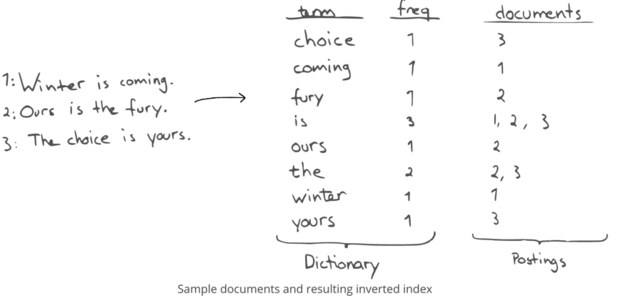

官方的doc无疑是最有价值的。

## 0 关于倒排索引

在基本的文本处理后(分词/变小写等), 如上三个文档变成了如图的倒排索引.

倒排索引将 “terms” 映射到 “doc” 上, 如图, 因为 terms 在 dictionary 中是有序的, 所以可以很快的找到这个词, 进而找到包含这个词的文档.

在倒排索引结构中, term 是搜索的单元. 举个例子, 在如上的 dictionay 中, 我么可以高效的找到已 c 字母开头的词, 但是,找包含 ours 词却
很困难, 因为这会遍历所有的 terms, 去找到像 yours 这样的词. 当索引很大时这种操作是十分好资源的.

实际上, 在 es 中, 他为每一个 JSON 字段都建立了自己的倒排索引.

## 1 描述

> Elasticsearch也使用Java开发并使用 **Lucene作为其核心** 来实现所有索引和搜索的功能，但是它的目的是通过简单的RESTful API来 **隐藏** Lucene的复杂性，从而让全文搜索变得简单。    
不过，Elasticsearch不仅仅是Lucene和全文搜索，我们还能这样去描述它：

> * 分布式的实时文件存储，**每个字段** 都被索引并可被搜索    
> * 分布式的实时分析搜索引擎    
> * 可以扩展到上百台服务器，处理PB级 **结构化或非结构化** 数据

## 2 shard & node & index 关系

> 一个分片(shard)是一个最小级别“工作单元(worker unit)”,它只是保存了索引中所有数据的一部分。**分片就是一个Lucene实例**，并且它本身就是一个完整的搜索引擎。我们的文档存储在分片中，并且在分片中被索引，但是我们的应用程序不会直接与它们通信，取而代之的是，直接与索引通信。
分片是Elasticsearch在集群中分发数据的关键。把 **分片想象成数据的容器**。文档存储在分片中，然后分片分配到你集群中的节点上。当你的集群扩容或缩小，Elasticsearch将会自动在你的节点间迁移分片，以使集群保持平衡。

## 3 副本与节点数对性能的影响

|情景|结论|扩容方法|
|--------|-------|-------|
|同样主副本，增加节点|每个分片获得更多的机器资源，主副本都能处理请求，吞吐量成倍增加|不修改副本数，直接加机器|
|同样节点，增加副本|优点：冗余了数据，其他的挂了，还能服务. 缺点：每个分片的所占有的硬件资源就减少了，而且大部分请求都聚集到了分片少的节点，导致一个节点吞吐量太大，反而降低性能|增加副本同时需要同时增加机器|

## 4 几个概念
文档
> 它特指最顶层结构或者根对象(root object)序列化成的JSON数据（以唯一ID标识并存储于Elasticsearch中）。

包含元数据：  

* index： 文档存储的地方。我们的数据被存储和索引在分片(shards)中，索引只是一个把一个或多个分片分组在一起的逻辑空间。blog    
* type： 索引类型。blogContent/blogComments    
* id： 唯一标识    

## 5 文档存储路由

进程不能是随机的，因为我们将来要检索文档。事实上，它根据一个简单的算法决定：    

~~~~
shard = hash(routing) % number_of_primary_shards
~~~~

routing值是一个任意字符串，它默认是_id但也可以自定义。这个routing字符串通过哈希函数生成一个数字，然后除以主切片的数量得到一个余数(remainder)，余数的范围永远是0到number_of_primary_shards - 1，这个数字就是特定文档所在的分片。

## 5 写和读操作的分片路由逻辑

基本逻辑是：

* 请求打到某个节点上。    
* 节点根据id和路由规则找到对应的shard操作

读和写还不太相同，具体见：    
http://es.xiaoleilu.com/040_Distributed_CRUD/15_Create_index_delete.html    
http://es.xiaoleilu.com/040_Distributed_CRUD/20_Retrieving.html

## 6映射
映射决定了这个字段的查询与分析。所以还是应该在存储之前将映射写好。

如：

~~~~

PUT /order
{
  "mappings": {
    "orderDetail" : {
      "properties" : {
        "orderId" : {
          "type" :    "long"
        },
        "phone" : {
          "type" :   "long"
        },
        "name" : {
          "type" :   "string"
          "index":    "not_analyzed"
        },
        "user_id" : {
          "type" :   "long"
        }
      }
    }
  }
}
~~~~

如此创建后，name字段可直接通过term查询即可，如：

~~~~
{
    "filter": {
        "bool": {
            "must": [
               {"term": {
                  "name": "hz"
               }}
            ]
        }
    }
}
~~~~

## 7. 使用别名，零停机时间迁移索引

* 将索引设置别名
* 迁移数据，比如更新一个字段的mappings。
* 原子操作，删除原来索引的别名引用，并同时增加这个索引的引用。

参考：http://es.xiaoleilu.com/070_Index_Mgmt/55_Aliases.html

## 8. 近实时查询之 倒排索引、段

关于倒排索引：    
http://blog.csdn.net/hguisu/article/details/7962350

关键点就是：  

* 怎样由单词（字段值）找到文件（model）：倒排
* 怎样找到单词：b-tree

段（segment）:    
一个段(segment)是有完整功能的倒排索引，但是现在Lucene中的索引指的是段的集合。

* 为了查询文档，使用倒排索引的方式将文档加入 **索引**。
* 而为了做到近实时查询，使用的是 **增量的方式组织索引**。
* 每一个增量索引就是一个 **段**。
* 每次查询要遍历所有的段，最终得到结果。

合并段：    
目的就是遍历的段的数量变少，优化查询。    
但是ES默认的合并方式已经可以满足，不需要手动调用api合并段。    
见：http://es.xiaoleilu.com/075_Inside_a_shard/60_Segment_merging.html    

## 9. 使用filter查询与cache

### 9.1 filter缓存的步骤

http://es.xiaoleilu.com/080_Structured_Search/05_term.html    

> Elasticsearch 在内部会通过一些操作来执行一次过滤：  

1. **查找匹配文档。**    
term 过滤器在倒排索引中查找词 XHDK-A-1293-#fJ3，然后返回包含那个词的文档列表。在这个例子中，只有文档 1 有我们想要的词。    
2. **创建字节集**    
然后过滤器将创建一个 字节集 —— 一个由 1 和 0 组成的数组 —— 描述哪些文档包含这个词。匹配的文档得到 1 字节，在我们的例子中，字节集将是 [1,0,0,0]    
3. **缓存字节集**    
最后，字节集被储存在内存中，以使我们能用它来跳过步骤 1 和 2。这大大的提升了性能，让过滤变得非常的快。    
当执行 filtered 查询时，filter 会比 query 早执行。结果字节集会被传给 query 来跳过已经被排除的文档。这种过滤器提升性能的方式，查询更少的文档意味着更快的速度。

### 9.2 filter过滤器的分类与使用

* term 过滤器
* terms 过滤器
* range过滤器
* exist和missing过滤器

* 组合bool过滤器。这是以其他过滤器作为参数的组合过滤器，将它们结合成多种布尔组合。

~~~~
bool过滤器的组成。

{
   "bool" : {
      "must" :     [],
      "should" :   [],
      "must_not" : [],
   }
}

must：所有分句都必须匹配，与 AND 相同。
must_not：所有分句都必须不匹配，与 NOT 相同。
should：至少有一个分句匹配，与 OR 相同。
~~~~

### 9.3 filter使用的优化点

####  什么样的过滤器会被缓存？

**首先**，term和terms，exist这样的过滤器都会被缓存，但是range却不一定。在我们的查询中，我们用的range过滤器都是针对long型字段的，这种
可以被缓存，但是想range date的这种，如果有now这样的条件，就不会。可以拆成两个range查询。一个是查大于的，一个是查小于的，这样还至少
能缓存一个range。    

具体见：http://es.xiaoleilu.com/080_Structured_Search/40_bitsets.html

**其次**，大部分直接处理字段的 **枝叶过滤器（例如 term）** 会被缓存，而像 **bool** 这类的组合过滤器则不会被缓存。

#### filter的过滤顺序是很大的优化点。

**按区分度排序过滤条件的过滤器。**

**在 bool 条件中过滤器的顺序对性能有很大的影响。更详细的过滤条件应该被放置在其他过滤器之前，以便在更早的排除更多的文档。
假如条件 A 匹配 1000 万个文档，而 B 只匹配 100 个文档，那么需要将 B 放在 A 前面。**
