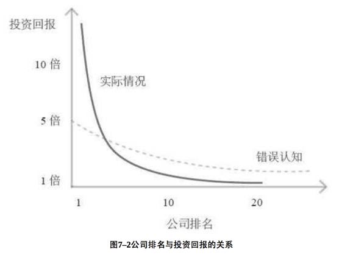

## 彼得·蒂尔

> 被誉为硅谷的天使，投资界的思想家。1998年创办PayPal并担任CEO，2002年将PayPal以15亿美元出售给eBay，把电子商务带向新纪元。2004年做了首笔在Facebook的外部投资，并担任董事。同年成立软件公司Palantir，服务于国防安全与全球金融领域的数据分析。蒂尔联合创办了Founders Fund基金，为LinkedIn、SpaceX、Yelp等十几家出色的科技新创公司提供早期资金，其中多家公司由PayPal的同事负责营运，这些人在硅谷有“PayPal黑帮”之称。他成立了蒂尔奖学金（Thiel Fellowship）鼓励年轻人在校园之外学习和创业。他还成立了蒂尔基金（Thiel Foundation），推动科技进步和对未来的长远思考。

## 从0到1

从0到1， 就是从无到有。

从无到有的进步更形象的描述为 `垂直或深入的进步`，而其他则可形容为 `水平或广泛的进步`。

## 根本性的思考

* 是否是从0到1的。
* 是否是有意义的。

## 垄断与竞争

有真正的、更强大的促进作用的不是竞争，而是垄断。而恰恰相反，大部分人在经营公司，经营人生的过程中，做的都是相反的事情。

#### 何为垄断，何为竞争

与完全竞争相反的是垄断。竞争性公司的产品由市场定价，而垄断公司拥有自己的市场，所以可以自己定价。没有了竞争，垄断公司可以自由决定供给量和价格，以实现利益最大化。

垄断企业推动社会进步，因为数年甚至数十年的垄断利润是有力的创新动机。之后垄断企业会不断创新，因为利润给了它们规划长远未来的资本，它们有能力投资雄心勃勃的研究项目，这些是困在竞争之中的企业想都不敢想的。

托尔斯泰在《安娜·卡列尼娜》中以下面这段文字作为开头：“幸福的家庭总是相似的，不幸的家庭各有各的不幸。”而在商业中，情形恰恰相反。企业成功的原因各有不同：每个垄断企业都是靠解决一个独一无二的问题获得垄断地位；而企业失败的原因却相同：它们都无法逃脱竞争。

#### 垄断公司的特点与如何建立垄断企业

特点：

* 专利技术
* 网络效应
* 规模经济
* 品牌优势

如何建立：

1. 占领小市场。    
在一个小市场里占主导地位比在大市场里要容易得多。如果你认为自己起步的市场可能太大，那就一定是太大了。

2. 扩大规模。    
一旦你成功创造了或是主导了一个利基市场，就要逐步打入稍大些的相关市场。比如亚马逊，杰夫·贝佐斯的愿景是使亚马逊成为在线零售业的主宰，但是他很谨慎，以图书作为起步。虽然有无数的书要登记，但是书都是相同的形状，很好装运，而且一些很难被卖出的书也会吸引热情的顾客（而任何一家零售书店都不会为了这一点利益而把这些书存着）

3. 不要搞破坏。    
也就是不要在虎口夺食。所以如果你准备扩张到相邻市场，不要“破坏”，要尽可能地躲开竞争。

你可能听说过“先发优势”：如果你是第一个进入市场的，在其他竞争者还在艰难起步的时候，你可以独自占据可观的市场份额。但先行一步只是个策略，不是目标。真正重要的是在未来产生现金流，因此如果有别的公司出现并取代了你，那么就算你是第一个做的也捞不到一点好处，反而那个最后下手的人更好——最终可以在一个特定的市场里取得重大进展，获得几年甚至几十年的垄断利润。要实现这个目标就要先主导一个小的利基市场，在这个基础上扩大，直到达到你预想的长远目标。至少在这一点上，经商就像下棋。国际象棋大师卡帕布兰卡说过：“要想赢，首要工作就是研究残局。”

#### 丢掉你的竞争意识，去谋划垄断的营生

在公司内部，人们为了升职，时刻关注对手动态。而公司为获得市场也留意着竞争者。在所有人类冲突的戏码中，人们往往忽视了真正重要的事情，只把精力放在竞争对手身上。

在公司之间，竞争使我们过分重视过去的机会，一味重复过去的模式。就如两家的争斗最终牺牲了两家的孩子，微软和谷歌竞争的结果是：苹果公司冒出来，压倒了它们的优势。2013年1月，苹果的市值是5 000亿美元，谷歌和微软加起来是4 670亿美元。而仅在3年前，微软和谷歌还都比苹果有价值得多。可见，竞争是一场高成本的买卖。

竞争使人出现幻觉，徒劳去抓一些并不存在的“机会”。除了给人幻觉外，竞争还让人分心。

## 幂次法则

> 凡是有的，还要加给他，叫他有余。凡没有的，连他所有的，也要夺过来。 - 《马太福音》

幂次法则是 从0到1 的表现。

还记得之前做过一个粗糙的分析（[销量大于一万趋势](https://github.com/younghz/TBBKAnalysis/wiki)），但是得到却是同样的结果。现在才清楚这是叫幂次法则。

幂次法则不只对投资者很重要，它对每个人都很重要，因为每个人都是投资者。一个创业者做的最大投资，就是花时间成立新公司。因此每个创业者都必须思考他的公司以后是否会成功、会有价值。同样，每个人都是一个投资者。你之所以选择一份职业，是因为你相信自己选择的工作在今后的几十年中会变得很有价值。

学校教给我们的却恰恰相反：体制化教育传授的是无差别的一般知识。每个身在美国教育体制中的人都没有学会用幂次法则来思考。每所中学不管什么课都一律上45分钟，每个学生都以相同的步伐向前迈进。在大学中，模范学生痴迷于学习另类的冷门技能，想以此保证自己的未来发展。每所大学都相信“卓越”，教育部门随意给出的几百页按字母排序的课程表看起来就是为了确保“你做什么并不重要，重要的是你要把它做好”。你做什么并不重要？真是彻头彻尾的错误。**你应该将全部注意力放在你擅长的事情上，而且在这之前要先仔细想一想未来这件事情是否会变得很有价值**。

## 基础决定命运

**一个漂亮的起跑线是多么重要。**

每个伟大企业都是独一无二的，而要做好每个事业，有些事情在起步阶段就必须做好。我经常强调这一点，以至于朋友们戏称它为“蒂尔定律”：基础没有打好的初创企业是无法挽救的。    

开头很特殊，它在本质上有别于之后的阶段。138亿年前宇宙的形成正是如此：诞生的最初那几微秒里，宇宙增大到原来的1030倍。在天体演化的新纪元到来的那一瞬间，物理法则与今天我们知道的大相径庭。

200多年前，美国的建立也是一样：几个月里，制宪者们在制宪会议上一起公开讨论国家的根本问题。中央政府应拥有多大的权力？国会议员代表席位应如何分配？无论你对那个夏天在费城达成的协议有何种看法，此后想要改变它都是困难的，因为1791年批准《人权法案》后，美国《宪法》只修改过17次。现在，尽管加利福尼亚州的人口超过阿拉斯加州50倍，两州在参议院的议员席位却是相同的。或许这就是特色，而不是缺陷。但是只要美国存在，就得坚持这一制度。再召开一次制宪会议是不可能的，因此今天我们只能讨论细节问题。

在这方面，公司就像国家。早先的错误决定一旦做出（比如选错合伙人、挑错员工），之后就很难改正。而要纠正这些错误，公司可能面临几近破产的危险。作为创始人，你的首要工作就是打好基础，因为你无法在有缺陷的基础上创建一个伟大的企业。

## 如何销售产品

占坑。未读。
