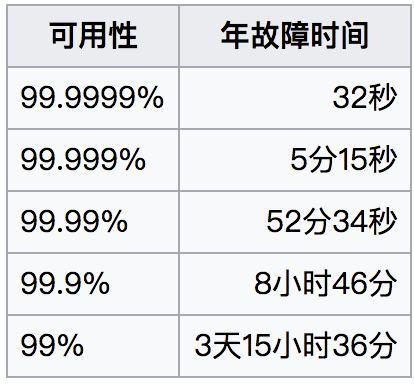

## 1 高可用定义
### 1.1 高可用

所谓的高可用，是指系统尽力保证 `fullTime` 对外提供服务的能力。通常，这样的系统或者服务通过软件或者硬件的冗余、完善的 `failover` 策略以及故障恢复能力来保证异常情况出现下的可用性。

### 1.2 可用性描述与衡量标准

系统可用程度（SLA）由以下两个指标来衡量：
* MTTF，平均无故障时间。
* MTTR，平均恢复时间。

系统可用性 HA = MTTF/(MTTF+MTTR) % 100。系统的可用性与故障时间的对应关系如下：

## 2 可用性提升方案
### 2.1 通用设计
#### 1 DID。
DESIGN 20；IMPLEMENT 3；DEPLOY 1.5。

#### 2 冗余。
要冗余但是不要冗余一切！冗余的范围应该是预算与单点影响的一个平衡。

#### 3 拆分。
拆分是一个非常可讲的话题，往大了讲可以谈到服务拆分，往小了说可以讲到请求/接口的拆分。举例来讲，单个服务提供的接口中以资源消耗的维度基本可分为：低/中/高三个维度，而如果按照关键程度可分为：关键/非关键，那么对于非关键但是资源消耗高的请求就需要用特定的方式进行处理。

通用的拆分方式可以参考「XYZ轴拆分」，用于拆分服务与数据。X-横向复制，Y-拆分不同的东西，Z-拆分相近的东西。

#### 4 隔离。
如数据层面的读写隔离，资源隔离等。

#### 5 去中心，无状态，水平扩展。
通常水平扩展依赖于服务的无状态。

#### 6 KISS原则设计服务于依赖
简单是最好的设计原则。    
轻依赖。

#### 7 用BASE解决CAP问题
根据服务情景选择C or A or P。    
用「基本可用」「软状态」「最终一致性」作为CAP的解决方案。

#### 8 异步化
#### 9 并行与串行化
并行问题串行化，串行问题并行化。     
多机事务单机话。

#### 10 事务与补偿
#### 11 避免单点

### 2.2 面向故障设计

#### 依赖故障
#### 1 熔断
减少自身阻塞与对依赖压力。
#### 2 超时
减少自身阻塞。
#### 3 容错设计，失败处理
优雅的依赖故障下的处理方式。
#### 4 超时
减少自身阻塞

#### 自身故障
#### 1 降级
同样是CAP的取舍问题。
#### 2 柔性设计
类似于1。
#### 3 自愈能力
故障自恢复能力，数据自恢复能力。
#### 4 流控
自我保护。
#### 5 数据保护
尽量做到Crash without data loss。
#### 6 留好退路。
回退开关。

### 2.3 运维
* 发布回滚。
* 持续集成
* 系统测试。
* 故障演练。

参考：
MySQL的复制和高可用，「高性能MySQL」
http://coolshell.cn/articles/17459.html
High Availability Concepts and Best Practices  https://docs.oracle.com/cd/A91202_01/901_doc/rac.901/a89867/pshavdtl.htm#10853
https://blog.coding.net/blog/architecture-concept-and-practice-from-Google
https://zh.wikipedia.org/wiki/%E9%AB%98%E5%8F%AF%E7%94%A8%E6%80%A7
