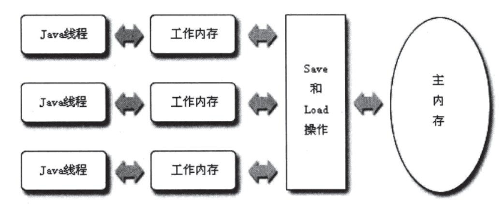

线程是并行的承载体，并行既是一些情景下完美的解决方案，又是代码复杂度和清晰度的洪水猛兽。

# 1 线程
**线程和进程**

操作系统的出现，使得单机多个程序在各自的进程中执行成为可能。各个进程统一由操作系统进行资源的分配，并通过 Socket、信号量、文件等方式进行通信。这种方式大大提高了资源的利用率。

轻量级进程 - 线程的执行通常有操作系统进行调度，分配时间片执行。同一个进程中的线程共享进程的内存地址空间，从同一个堆中进行对象的分配，与进程通信相比，天然有了更好的数据共享优势。但是，每个线程都存在自己的程序计数器、栈、本地变量，也更好的实现了任务的隔离。

**处理器和线程**

当单核处理器的时钟频率到达发展瓶颈时，增加处理器内核就成了提升性能的主要方式。多线程异步的方式让处理器的利用率最大化，使单线程的阻塞对处理器利用率以及服务吞吐的影响最小化。

但是需要注意的是，不管是在操作系统层面还是单个进程层面，通常对于线程的总数量是有限制的，那么怎么用尽可能少的线程去做更大的并发呢，在网络IO层面，epoll 或者是 select poll 采用了统一管理连接，轮询连接文件描述符的方式做到了这一点。（https://segmentfault.com/a/1190000003063859）

**Java线程状态**

* New。创建了但还未start的线程。
* Runnable。此时线程有肯能在running(获取到时间片执行)或者ready（等待fe分配时间执行）。
* Waiting & Timed Waiting。如执行了Object.wait()操作，这种需要其它线程唤醒或者到达超时时间，这种状态的线程不会被分配执行时间。
* Blocked。线程等待锁。
* Terminate。线程执行结束。

## 1.1线程风险

* 性能问题。通常是由上下文切换和资源锁定产生。
* 安全、正确性问题。非同步的问题。
* 资源竞争。单个线程对资源的错误的、持续的持有。


以上三点通常是多线程编程的风险点所在。

#### 1.1.1 线程安全

线程安全的定义：

当多个线程访问一个类时，如果不用考虑多线程下的操作，也不需要额外的同步代码，这个线程的行为仍然是正确的，那么它就是线程安全的。


从两个层面来讲，以下两种情景是线程安全的：
* 无状态
* 有状态，但是对状态的操作是同步的

并发变成的关键就是对状态（类数据）的访问与管理。并且如下两点总是正确的：
* 不可变对象永远是线程安全的
* 无状态类永远是线程安全的

#### 1.1.2 对象共享

**可见性**

对象的可见性是指一个线程对数据的修改对其他线程是立即可见的，通常可见性通过：
* 锁、同步块 （可见性与原子性保证）
* volatile （只能保证可见性，并不能保证原子性）

**线程封闭**

线程安全的最大难点在于对「共享的」、「可变的」数据的访问控制，尽量少的共享数据，也就降低了并发编程的难度，在允许的情况下尽可能多的使用：
* 本地变量（栈封闭）
* ThreadLocal 类
以减少数据多线程共享。

#### 1.1.3 线程安全的类设计模式

核心思想是：
* 最小状态暴露，暴露状态使用同步方法封装。（JAVA监视器模式）
* 使用代理模式将不安全状态包装。（Delegate代理模式）
* 客户端（非线程安全的类使用者）加锁


**内部限制**

将数据封装在对象内部，把对数据的访问限制在对象的方法上，并通过同步、锁等方式确保方法是线程安全的。
```
class ThreadSafeMap {
    private Map<String, Integer> unsafeMap = Maps.newHashMap();

    public synchronized putIfAbsent(String key, Integer value) {
        if (unsafeMap.contains(key)) {
            return unsafeMap.get(key);
        }
        unsafeList.add(key, value);
        return null;
    }
}
```

**代理模式-外部包装**

使用同步方法或者同步数据结构包装非线程安全状态。

```
class ThreadSafeMap {
    private HashMap<String, Integer> safeMap = new ConcurentHashMap();

    public putIfAbsent(String key, Integer value) {
        return safeMap.putIfAbsent(key, value);
    }
}
```

客户端加锁（谨慎使用，注意客户端锁需要和内部锁一致）

1 有问题的代码：

```
class MapHelper {
    private Map<String, Integer> unsafeMap;
    public MapHelper(Map map) {
        this.unsafeMap = map;
    }

    public synchronized putIfAbsent(String key, Integer value) {
        if (unsafeMap.contains(key)) {
            return unsafeMap.get(key);
        }
        unsafeList.add(key, value);
        return null;
    }
}
```

正确的代码(同一把锁)：

```
class MapHelper {
    private Map<String, Integer> unsafeMap;
    public MapHelper(Map map) {
        this.unsafeMap = map;
    }

    public putIfAbsent(String key, Integer value) {
        synchronized (unsafeMap){
            if (unsafeMap.contains(key)) {
                return unsafeMap.get(key);
            }
            unsafeList.add(key, value);
            return null;
        }
    }
}
```


## 1.2 并发容器与锁

**使用并发容器代替同步容器**
如使用ConcurrentHashMap 和 CopyOnWriteList这类并发容器代替需要在使用时在客户端加锁的 Collections.synchronizedList()这类的容器封装。


**使用阻塞队列构造生产者-消费者模式**
阻塞：当线程的状态为 BLOCKED/WAITING/TIME_WAITING时，称这个线程为阻塞状态。线程的阻塞的原因为资源等待，如等待IO、等待锁、或者等待从Thread.sleep中唤醒。

中断：可阻塞的方法会抛出InterruptedException异常，中断操作是其他线程通过中断的方式让线程提前退出阻塞状态。对于中断的处理方式通常有两种：捕获、捕获并传递。

**双端队列**
与上面所述的阻塞队列所有消费者共享单个队列不同，可以通过让每个消费者都持有自己的一个双端队列的方式来解决传统的生产消费模式中的生产者和消费者同体的问题。这种多队列的方式通常和「窃取模式」的设计相关联，这种模式通过让消费者在正常情形下访问自己的队列，并且可以通过窃取其他队列的任务的方式来更好的解耦与增加消费能力。

利用FutureTask构建高效缓存

```
/**
 * User: yanghaizhi
 * Date: 2017/7/9
 * Time: 下午3:51
 */
public class FutureCache {

    /**
     * 1. 使用并发容器
     * 4. 使用 Future<String>而不是 String , 可以避免缓存并发穿透的问题
     */
    private final ConcurrentHashMap<String, FutureTask<String>> cache =
            new ConcurrentHashMap<String, FutureTask<String>>();


    public String get(String param) throws Exception{

        Preconditions.checkArgument(null != param, "param check error!");

        Future<String> future = cache.get(param);

        if (null == future) {

            Callable compute = new Callable() {
                public Object call() throws Exception {
                    // 从下层获取数据
                    return String.valueOf("从下层获取数据");
                }
            };
            FutureTask futureTask = new FutureTask(compute);

            /**
             * 2. 原子操作
             */
            FutureTask<String> ft = cache.putIfAbsent(param, futureTask);
            if (null == future) {
                future = ft;
                ft.run();
            }
        }

        try {
            return future.get();
        } catch (Exception e) {
            /**
             * 3. 无remove ,避免一直查不到
             */
            cache.remove(param);
            throw new Exception(e);
        }
    }


}
```

# 2 Java内存模型

多线程下的数据一致性问题可以归结为两种来源：
1. 硬件层面：为了缓解处理器和内存处理速度不匹配问题，在二者之间引入了高速缓存，对于多处理器，缓存带来的问题就是经典的「缓存不一致问题」，经典问题也有经典方案，如读写的MESI协议等。
2. 语言处理层面：处理器的代码乱序优化与虚拟机的指令重排序等。

#### 内存模型与内存操作

Java虚拟机对上屏蔽了特定硬件与操作系统的一致性操作，提供了一套类似的处理机制，也就是Java内存模型。



对应与上面的三部分：主内存、工作内存和执行引擎的变量的操作按读、写、锁分为三类原子操作。
* 读：read/load/use，代表从主内存加载到工作内存、工作内存副本保存与执行引擎变量加载使用。其中read和load需要一起出现。
* 写：assign/store/write，分别代表执行引擎写入工作内存、变量从工作内存传送到主内存、主内存变量赋值写入。其中store和write要一起出现。
* 锁操作：lock/unlock，作用与主内存，代表一个变量被一个线程唯一占用。

以上为针对于Java内存模型变量等的操作，一致性问题来源一(见上)的方案也大多是针对于这些操作的控制完成的，而其二问题一般是通过内存屏障的方式来做。

**volatile**
以volatile为例，被其修饰的变量通过如下的约束来实现：
* 禁止指令重排序
* 对读写指令的出现约束，如同一个变量的load和use要连续出现，写方面assign和store也有同样的要求。

针对于volatile，Java控制原子操作组合/顺序以及指令重排序的方式达到其修饰变量具有可见性的目标。如果需要更大范围的原子性，需要的是lock指令和语义。
