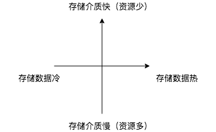
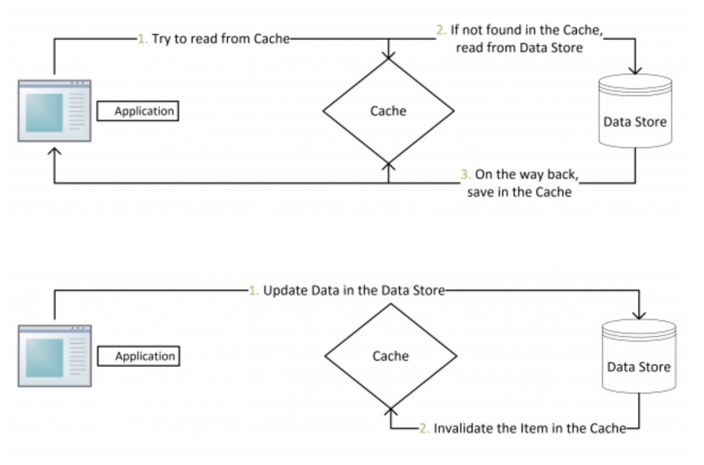
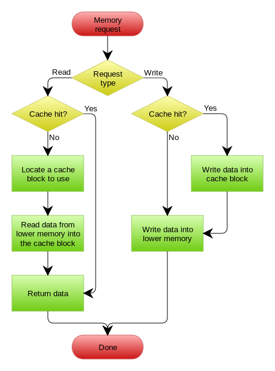

* 目录
{:toc}


# 1 缓存概念
## 1.1 缓存

缓存的概念最开始出现在一篇电子期刊论文中，主要指计算机工程中的 CPU 与内存之间的用于加快访问速度的存储介质（方式）。后来这种概念扩充到更广泛的领域，如在内存与磁盘、磁盘与网络等之间的任何用于协调两种不同访问速度介质之间的存储或者方案，都可以被称之为缓存。


下面是[wikipedia中的缓存条目](https://zh.wikipedia.org/wiki/%E7%BC%93%E5%AD%98)中对缓存的介绍：

> Cache 一词来源于1967年的一篇电子工程期刊论文。其作者将法语词“cache”赋予“safekeeping storage”的涵义，用于计算机工程领域。PC-AT/XT和80286时代,没有Cache，CPU和内存都很慢，CPU直接访问内存。80386的芯片组增加了对可选的Cache的支持，高级主板带有64KB，甚至高端大气上档次的128KB Write-Through Cache。80486 CPU里面加入了8KB的L1 Unified Cache，当时也叫做内部Cache，不分代码和数据，都存在一起；芯片组中的Cache，变成了L2，也被叫做外部Cache，从128KB到256KB不等；增加了Write-back的Cache属性。Pentium CPU的L1 Cache分为Code和data，各自8KB；L2还被放在主板上。Pentium Pro的L2被放入到CPU的Package上。Pentium 4开始，L2 Cache被放入了CPU的Die中。从Intel Core CPU开始，L2 Cache为多核共享。

> 如今缓存的概念已被扩充，不仅在CPU和主内存之间有Cache，而且在内存和硬盘之间也有Cache（磁盘缓存），乃至在硬盘与网络之间也有某种意义上的 Cache──称为Internet临时文件夹或网络内容缓存等。凡是位于速度相差较大的两种硬件之间，用于协调两者数据传输速度差异的结构，均可称之为Cache。


** 缓存最初的目的是解决CPU处理和内存访问数据速度的不对等性：**

> 提供“缓存”的目的是为了让数据访问的速度适应CPU的处理速度，其基于的原理是内存中“程序执行与数据访问的局域性行为”，即一定程序执行时间和空间内，被访问的代码集中于一部分。为了充分发挥缓存的作用，不仅依靠“暂存刚刚访问过的数据”，还要使用硬件实现的指令预测与数据预取技术——尽可能把将要使用的数据预先从内存中取到缓存里。


** CPU 缓存中的「局部性」理论 **，[wikipedia条目](https://zh.wikipedia.org/wiki/CPU%E7%BC%93%E5%AD%98)。 在缓存概念被扩展到应用间缓存时，时间局部性也应该是衡量数据是否要缓存以及决定缓存命中率的关键因素之一。

> 缓存之所以有效，主要是因为程序运行时对内存的访问呈现局部性（Locality）特征。这种局部性既包括空间局部性（Spatial Locality），也包括时间局部性（Temporal Locality）。有效利用这种局部性，缓存可以达到极高的命中率。


# 2 缓存实现与实践

## 2.1 本地缓存

### 2.1.1 Ehcache

[Ehcache](http://ehcache.org/)

作为 Java 本地缓存领域使用最广泛的缓存框架，EhCache 在缓存介质（DataStore）的支持上有其他本地缓存组件不存在的优势，支持堆内、堆外、磁盘等多种缓存介质，更为强大的是， Ehcache 利用 Tiers 的概念可以将多种缓存介质组织起来，在数据存储和数据访问中，以一定的操作和顺序组织多层介质。

其中，Ehcache 支持的 DataStore 可以用「速度」与「容量」(数据热度)这两个维度做组织和区分：

* On-Heap Store，速度：最快。空间：小于JVM堆空间。影响：数据量越大，JVM garbage collector 扫描时间越长，garbage collect pauses 时间越长。
* Off-Heap Store。速度：很快，但是比 On-Heap 慢，因为当存储和访问操作时仍要移到 JVM 堆中。空间：小于机器内存空间。影响：不受GC限制。
* Disk Store。速度：要比基于 RAM 的 Store 慢得多。空间：基于磁盘，小于磁盘大小。

又大（价格低）又快的存储介质是不存在的，介质与数据的二维图可以表示为：


### 2.1.2 Caffeine(Guava)

[Caffeine](https://github.com/ben-manes/caffeine/wiki)

如果数据量不是很大，并且可以接受 On-Heap 空间的使用对应用造成的影响，那么可以使用 Caffeine。
Caffeine 提供了 Cache/LoadingCache/AsyncLoadingCache 多种缓存的实现。Caffenine 对几种缓存模式都有很好的支持，如通过 LoadingCache 实现 Cache-Aside 模式，通过 [Writer](https://github.com/ben-manes/caffeine/wiki/Writer) 对 Cache-As-SoR 模式提供实现支持。

### 2.1.3 Hollow

[Hollow](https://github.com/Netflix/hollow)

针对G级别以及以下量级的数据，并且这些数据希望在所有机器同样全量副本，通过本地缓存方式提供查询，从而避免远程访问在大QPS下可能的稳定性和延时问题。
针对这种情景，如果实现可能在如下几点有问题：

* 数据集大小受可用RAM限制。
* 完整的数据集可能需要在每次更新时重新下载。
* 更新数据集可能需要大量CPU资源或影响GC行为。

Hollow在以下几方面做了优化：
* JVM heap空间占用
* JVM GC的影响
* 单生产多消费流程与模式

#### 2.1.4 布隆过滤器

[BloomFilter](https://zh.wikipedia.org/zh-hans/%E5%B8%83%E9%9A%86%E8%BF%87%E6%BB%A4%E5%99%A8)

如果缓存数据只是为了验证「有没有」，并且能接受一定的误识率，那么可以考虑布隆过滤器的实现（Guava 有一个实现）。需要存储的值通过一些哈希函数得到不同的哈希值，然后将哈希值存储到 bit 数组中。布隆过滤器的这种实现使其插入和查询的时间复杂度都是 O(K)，除了这个优点，布隆过滤器的另一个优势在于其空间占用，通常亿级数据的占用空间在百兆一下（和容忍的误判率有关）。

## 2.2 分布式缓存

当前比较主流的分布式缓存实现主要有 Redis/Tair/Memcache，Redis 和 Memcache 相比，提供了更丰富的内置数据结构，如果希望更大的存储空间，并且数据冷热分明，可以尝试Tair、Pika、ssdb 等组件。

除此之外，还存在其它非常多针对不同使用情景的缓存实现，如主打实时计算的Gemfire等等。

# 3 缓存涉及到的技术点

## 3.1 缓存模式

缓存模式通常分为两种：
* Cache-Aside。
* Cache-as-SoR，这种又包含 read/write through，write back。

针对读来讲，Cache-Aside 可以见简单的归结为 `if cached, return; otherwise create, cache and return"`	，这也被大部分缓存组件实现为 `get(Key key, Callable cacheLoader)`。


此图来源于 [collshell](https://coolshell.cn/articles/17416.html)

Cache-as-SoR 的含义是把缓存作为时间数据源操作的代理层，在 Caffeine 中，使用 Writer 配置 CacheLoader 可以实现这个模式。

```java
LoadingCache<Key, Graph> graphs = Caffeine.newBuilder()
  .writer(new CacheWriter<Key, Graph>() {
    @Override public void write(Key key, Graph graph) {
      // write to storage or secondary cache
    }
    @Override public void delete(Key key, Graph graph, RemovalCause cause) {
      // delete from storage or secondary cache
    }
  })
  .build(key -> createExpensiveGraph(key));
```


此图来源 [wikipedia](https://en.wikipedia.org/wiki/Cache_(computing)#Writing_policies)


在 Ehcache 的 [文档中](http://www.ehcache.org/documentation/3.5/caching-patterns.html), 有一节专门介绍缓存模式。

## 3.2 使用缓存考虑的点


* 多少 key，需要多大空间？
* 单条 entry 大小？
* 是否有热点？（数据预热；多级缓存；Facebook的数据复制（key:xxx#N）；加载到应用本地。）
* 命中率评估？
* 访问量，QPS多少？
* 失效策略？
* 缓存写策略？
* 怎么监控，统计命中？
* 是否会存在缓存穿透，怎么加载？
* 选择本地缓存还是分布式缓存？
* 本地缓存怎么更新？（定时 Pull；变更广播 Push）
* 使用缓存引入什么影响？如对堆内缓存影响 GC，序列化消耗 CPU等
* 缓存和数据源的数据一致性？